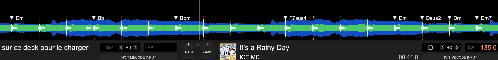

## Version

Apple only (Mac arm)
✔ Python = main code
✔ AppleScript = launcher
---------------------------------------------
Changelog :
V13.2 : Make Python path portable using user home (~/.venvs/audio312)
V13.1 : improve thirds m/M detection
🔥 V13 – BeatGrid-Aware Chord Detection (DJ Clean Engine)

🎯 Major Update

This version introduces VirtualDJ BeatGrid integration (fixed & variable BPM) to significantly improve chord timing accuracy and musical relevance.

⸻

🧠 New Features

🎧 BeatGrid Integration (VirtualDJ XML)

* Supports both:
    * ✔ Fixed BPM (Bpm + Phase)
    * ✔ Variable BPM (fluid) (BeatGrid=...)
* Automatically extracts beat positions from VirtualDJ database
* Falls back to librosa beat detection if unavailable

👉 Result: chords are now aligned with actual DJ beat structure

⸻

⚡ Improved Timing Accuracy

* Chords are snapped to:
    * nearest beat (with tolerance)
    * real musical grid instead of estimated rhythm
* Much better coherence for DJ mixing & cueing
V12 - Stable release

-------------------------------------------------------

# VirtualDJ Chords Injection

AI-powered chord detection and injection tool for VirtualDJ `database.xml`.



This tool analyzes your audio files (AIFF, WAV, FLAC, etc.), applies fine pitch detection and correction to **A=440 Hz**, and writes chords as POI markers directly into VirtualDJ.
It also creates an automatic fine pitch POI so tracks can be played closer to A=440 Hz, making them easier to use with external instruments such as synths, VSTs, or piano.

---

## ⚠️ macOS Requirement

⚠️ **macOS Full Disk Access is required for AppleScript to work properly**
VirtualDJ 2026 > BUILD 9295 (2026-04-19)
macOS (Apple Silicon recommended)
Python 3.10+
VirtualDJ

Make sure to have this kind of Python path:

/Users/YOUR_USERNAME/.venvs/audio312/bin/python

---

## Features

- Fast batch chord detection
- Fine pitch detection & correction (to A=440 Hz)
- Writes chords directly into VirtualDJ database
- Automatic database backup
- Supports large libraries (thousands of tracks)
- Optimized for macOS (Apple Silicon)

---
## VirtualDJ Compatibility

Tested with:

- VirtualDJ 2026 > BUILD 9295 (2026-04-19) (New Fluid Database.xml synthax)

⚠️ Older versions may not support all POI features or database structure.


------------------------------------------------------------------------------------------------------------

## macOS Terminal Installation Guide

This AppleScript expects Python to be installed at:

```applescript
property pythonBin : "/Users/" & (short user name of (system info)) & "/.venvs/audio312/bin/python"
```

So you must create the Python environment exactly here:

```text
~/.venvs/audio312
```

---

### 1. Install Homebrew

Copy and paste:

```bash
/bin/bash -c "$(curl -fsSL https://raw.githubusercontent.com/Homebrew/install/HEAD/install.sh)"
```

Then (Apple Silicon Macs):

```bash
eval "$(/opt/homebrew/bin/brew shellenv)"
```

---

### 2. Install Python

```bash
brew install python
```

Check installation:

```bash
python3 --version
```

---

### 3. Create the virtual environment

```bash
mkdir -p ~/.venvs
python3 -m venv ~/.venvs/audio312
```

---

### 4. Activate the environment

```bash
source ~/.venvs/audio312/bin/activate
```

---

### 5. Upgrade pip

```bash
python -m pip install --upgrade pip
```

---

### 6. Install required packages

```bash
pip install numpy scipy librosa soundfile
```

---

### 7. Verify installation

```bash
~/.venvs/audio312/bin/python -c "import numpy, scipy, librosa, soundfile; print('Python environment OK')"
```

Expected output:

```text
Python environment OK
```

---

### ⚠️ Important

Do NOT move or rename this folder:

```text
~/.venvs/audio312
```

The AppleScript depends on this exact path.

---

### 🛠 If something doesn't work

You can reinstall everything:

```bash
rm -rf ~/.venvs/audio312
python3 -m venv ~/.venvs/audio312
source ~/.venvs/audio312/bin/activate
pip install numpy scipy librosa soundfile
```

---

## 🔒 macOS Permissions (IMPORTANT)

This script needs access to your files and VirtualDJ database.

You must grant **Full Disk Access** to the application running the AppleScript.

### Steps:

1. Open **System Settings**
2. Go to **Privacy & Security**
3. Click **Full Disk Access**
4. Add:
   - **Script Editor** (if you run the script from it)
   - OR the compiled **AppleScript app**
   - OR **Terminal** (if running via Terminal)

5. Restart the application

---

### ⚠️ Important Notes

- Do NOT open **VirtualDJ** during analysis  
- Always backup your `database.xml` before running the script  
- Use this tool at your own risk (advanced users only)
---

## AppleScript Python Path

Make sure to have this kind of Python path:

/Users/YOUR_USERNAME/.venvs/audio312/bin/python

Applescript auto detect YOUR_USERNAME :
property pythonBin : "/Users/" & (short user name of (system info)) & "/.venvs/audio312/bin/python"

------------------------------------------------------------------------------------------------------------------------------------------

## Usage

1. Double-click:

CHORD-DETECTION-VIRTUALDJ.scpt

- The AppleScript file and the Python (.py) file must be located in the same folder for the script to run correctly
  
2. Select your `database.xml`

3. Choose analysis mode:
- Full folder
- Single file
- Filter by first letter

4. Let the analysis run in Terminal

---

## VirtualDJ Usage Notes ⚠️
- Tracks should already be analyzed by VirtualDJ beforehand (BPM, grid, etc.) 

### Do not open VirtualDJ during analysis

- The script automatically closes VirtualDJ before starting
- Do NOT reopen VirtualDJ during analysis
- This may corrupt or overwrite your database

---

### Selecting the correct database.xml

#### External drive (recommended)

/Volumes/YourDrive/VirtualDJ/database.xml

👉 Auto-detected by the script if available

---

#### Internal drive

/Users/YOUR_USERNAME/Library/Application Support/VirtualDJ/database.xml

---

### Important

- Always select the database matching your audio files location
- Using the wrong database will result in:
  - Missing chords
  - Wrong library being modified

---

## macOS Permissions ⚠️ (Important)

If you get errors like:

Operation not permitted
Permission denied

Enable Full Disk Access:

System Settings → Privacy & Security → Full Disk Access

Add:
- Terminal
- Script Editor (or the app used to run the script)

---

## ⚠️ Disclaimer & Safety

### Use at your own risk

This tool directly modifies your VirtualDJ `database.xml`.

👉 You MUST manually backup your database before using this tool.

Example:

Copy database.xml → database_backup.xml

---

### Important Warning

- This tool is intended for **advanced users and developers only**
- Incorrect usage may:
  - Corrupt your VirtualDJ database
  - Cause data loss
  - Affect your music library

---

### Liability

By using this tool, you agree that:

- You are fully responsible for any changes made
- The author is **not responsible** for any damage or data loss
- This tool is **not affiliated with VirtualDJ or its developers**

---

### Safety Summary

✔ Always backup your database manually  
✔ Do not run VirtualDJ during analysis  
✔ Use only if you understand the process  

---

## Recommended Audio Formats

- AIFF ✔ (best)
- WAV ✔
- FLAC ✔
- M4A / AAC ⚠️ (slower, less accurate)

---

## Tested Environment

- macOS (Apple Silicon)
- Python 3.12
- librosa 0.10+

---

## License

MIT License (recommended)
